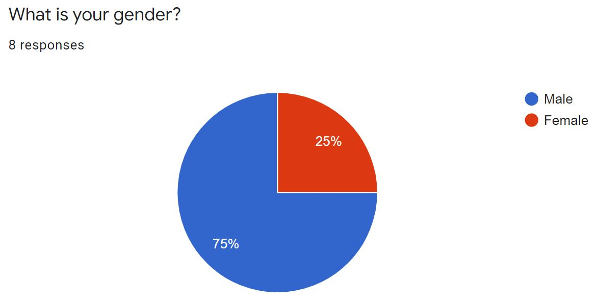
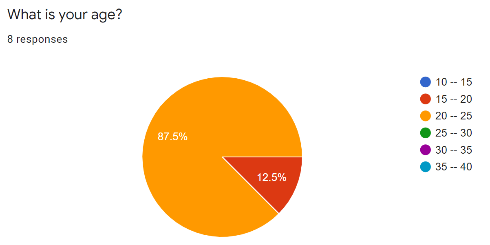
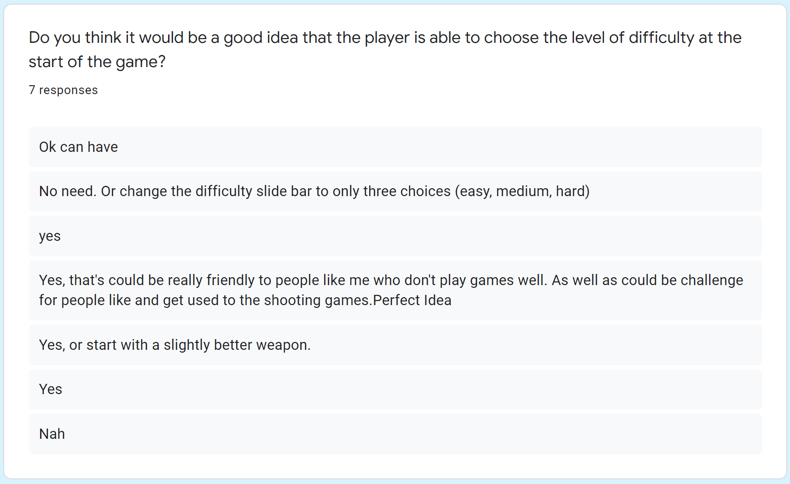
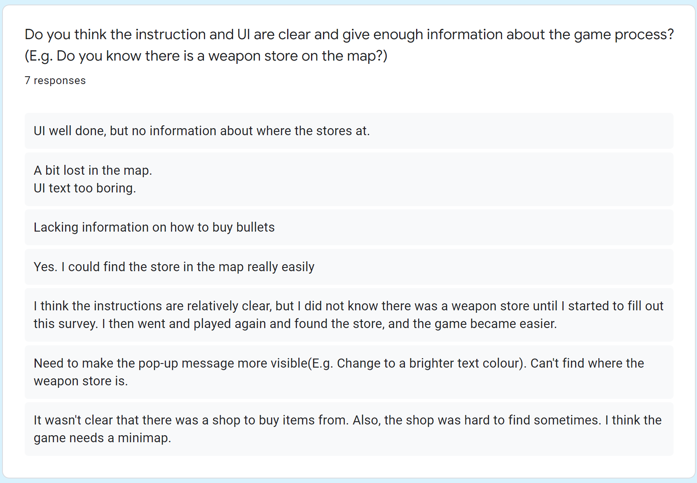
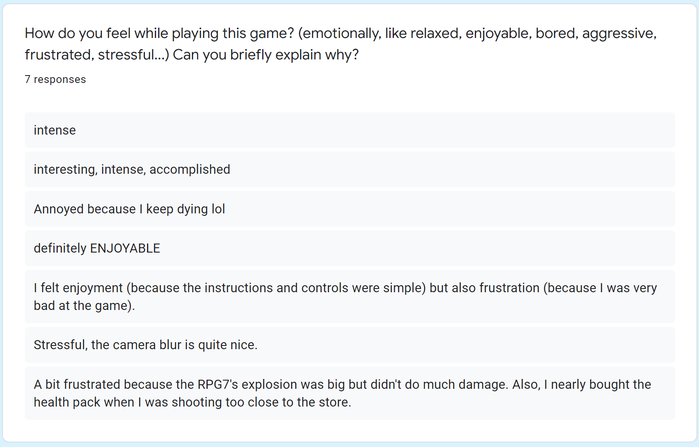
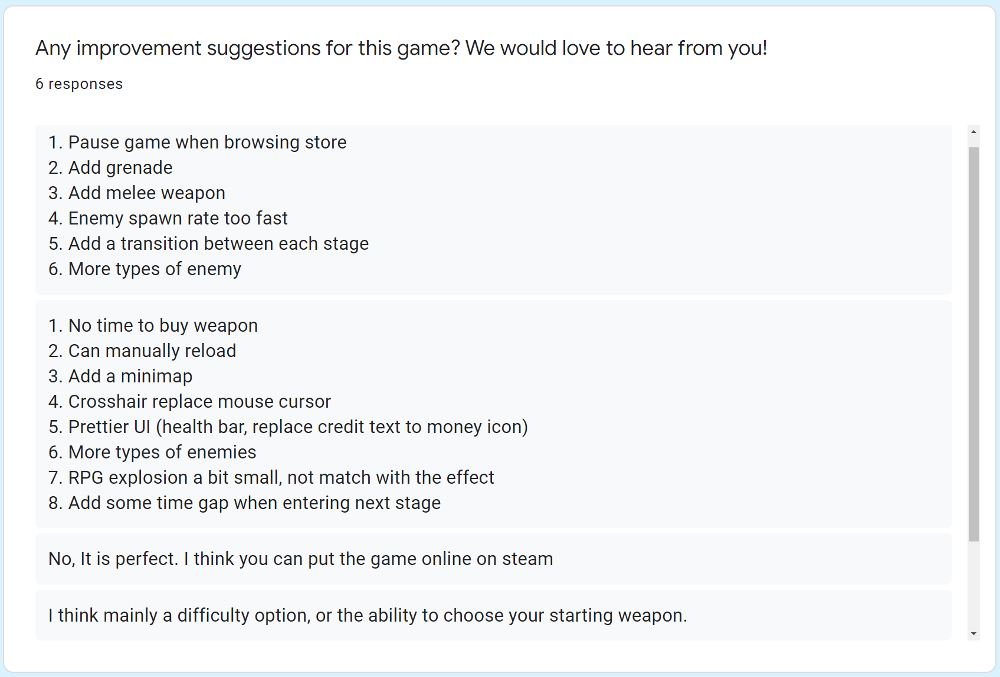
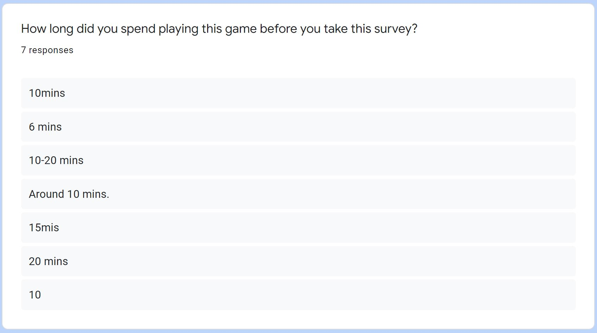

**The University of Melbourne**

# COMP30019 – Graphics and Interaction

Final Electronic Submission (project): **4pm, Fri. 6 November**

Do not forget **One member** of your group must submit a text file to the LMS (Canvas) by the due date which includes the commit ID of your final submission.

You can add a link to your Gameplay Video here but you must have already submit it by **4pm, Sun. 25 October**

## Final Product

- Game Link (play in FullScreen): 

https://outpost-defence.herokuapp.com/

- Game demo video: OUTPOST DEFENCE -- Game Trailer 

https://www.youtube.com/watch?v=whNglbiKtTw&list=LL&index=6

# Project-2 README

You must modify this `README.md` that describes your application, specifically what it does, how to use it, and how you evaluated and improved it.

Remember that _"this document"_ should be `well written` and formatted **appropriately**. This is just an example of different formating tools available for you. For help with the format you can find a guide [here](https://docs.github.com/en/github/writing-on-github).

**Get ready to complete all the tasks:**

- [x] Read the handout for Project-2 carefully

- [x] Brief explanation of the game

- [x] How to use it (especially the user interface aspects)

- [x] How you modelled objects and entities

- [x] How you handled the graphics pipeline and camera motion

- [x] Descriptions of how the shaders work

- [x] Description of the querying and observational methods used, including: description of the participants (how many, demographics), description of the methodology (which techniques did you use, what did you have participants do, how did you record the data), and feedback gathered.

- [x] Document the changes made to your game based on the information collected during the evaluation.

- [x] A statement about any code/APIs you have sourced/used from the internet that is not your own.

- [x] A description of the contributions made by each member of the group.

## Table of contents

- [Team Members](#team-members)
- [Explanation of the game](#explanation-of-the-game)
- [Game Instruction and control](#game-instruction-and-control)
- [Objects & Entities model](#objects-&-entities-model)
- [graphics pipeline & camera motion](#graphics-pipeline-&-camera-motion)
- [Shaders](#shaders)
- [Evaluation - Methodology](#Evaluation---Methodology)
- [Evaluation - Participants description](#Evaluation---Participants-description)
- [Evaluation - Feedback](#Evaluation---Feedback)
- [Changes made from feedback](#changes-made-based-on-the-evaluation)
- [Reference](#reference)
- [Technologies](#technologies)
- [Appendix](#appendix)

## Team Members

| Name               |                                                                                       Task                                                                                        | State |
| :----------------- | :-------------------------------------------------------------------------------------------------------------------------------------------------------------------------------: | ----: |
| Yifei Yu           | Main game environment, Instructions scene, Start menu scene, Enemy AI, Enemy wave spawner, Game store, Options scene, In-game UI, Weapon swap/reload, Pause scene, Pop up message |  Done |
| Juntong(Angel) Tan |                  Shooting mechanism, Weapons, Bullets, Particle system effect(Damage explosion, Burning fire with smoke/sparks/flame/glow), Shader, Sound effect                  |  Done |
| Adrian Tang        |                                                                 Camera, Character Animation, Blur Shader, Weapon                                                                  |  Done |

## Explanation of the game

**Outpost Defence** is a top-view survival shooter game where the player is trapped in a military outpost in the middle of the desert. He has to fight his way out of waves and waves of enemies who are trying to invade the outpost. Luckily, there are still some weapons and equipments left behind to help him survive the enemy swarm.

_Are you dare to take the challenge and help us defend the outpost at all cost?_ :skull:

## Game Instruction and control

### Game Control:

W, A, S, D – Movement: Use these keys to move forward (W), left (A), backwards (S), and right (D).

Q or Mouse Wheel – Change Weapon: Swap the weapon by either pressing the Q key or rolling the Mouse Wheel up or down.

Mouse – Aim/Look: Move the mouse around to have your character look around or aim a weapon.

Left Mouse Button – Fire Weapon: This expels projectiles from your weapon's chamber.

### Goal:

-Kill the enemy waves and survive.

-There are five game levels, survive the five levels to win the game.

-If the level count down time becomes zero, you need to kill the remaining enemies on the map before leveling up.

### Notes:

-You can purchase new weapons and health packs in the game store using the in-game currency earned by killing the enemies. The game store is the yellow military tent on the middle left of the map with a shop icon jumping up and down. The shop menu will pop up when you walk near the yellow military tent.

-After purchasing any new weapons, you can either pressing the Q key or rolling the Mouse Wheel up or down to change weapons.

-If the weapon is out of ammo, purchase the same weapon again to restock the ammo.

-The revolver has infinite amount of ammos.

## Objects & Entities model

### Game object model

All the models used in this game are acquired from various packages in unity store. Those include but not limited to the prefabs shaping our game environment, characters and weapons. Full list of the packages is listed under [_Reference_](#reference)

### Animation

All humanoid animation files (.fbx) are obtained from [Mixamo.com](https://www.mixamo.com/#/). Then we create our own animator component to control the states for each animations and assign it to the script so that our characters can perform the appropriate animation in the game.

## Graphics pipeline & Camera motion

### Graphics pipeline

The graphics pipeline used in this game will be Direct3D 11 and runs in the following way: Firstly, the **vertex shader** handles the mesh data of objects (vertices). Then in the **rasterizer stage**, we performed _occlusion culling_ where any non visible objects that are currently can't be seen by the camera will not be rendered. After that, the **fragment shader** produces colour and lighting for the objects. The final projection undergoes transformations and then converted to the screen space.

Additionally, we have two shaders that change the behaviours in some of the procedures in the rendering pipleline to produces the desired effect. <br>
First one is the water shader thats make use of the **vertex shader** and **fragment shader** to produce a continuous "waterfall" effect by moving the material constantly. We also have a radial blur shader that adds a post-processing effect on the final texture. In that case, we are modifying the **fragment shader** to allow the effect takes place in the projection of the screen space.

Both shaders will be explained in detail in the [later section](#shaders).

### Camera

Camera is placed above the player pointing downward to mimic a **top-down/God view** style. It is setup to trace the player location so that it is always in the center of the screen.

## Shaders

### Radial blur shader

<p align="left">
  
</p>

This is an **image effect** shader that adds a post-processing effect on the final image shown on the screen. The blur effects will become visible once the player's health drops to a certain point. The lower the health is, the more blurriness it will appear. It is used to indicate how injured the player currently is and hopefully makes him feels more engaged in the game.

```C#
Properties
{
  _MainTex ("Texture", 2D) = "white" {}
  // determines how many times the main texture will be sampled
  _Samples("Samples", Range(4, 32)) = 16
  // determines how intense the effect is going to be
  _EffectAmount("Effect amount", float) = 1
  // determines the center around which the radial blur will occur,
  // in screen space coordinates, now it is hard-coded to be center.
  _CenterX("Center X", float) = 0.5
  _CenterY("Center Y", float) = 0.5
  // determines the radius of the area that is unaffected by the blur.
  _Radius("Radius", float) = 30
}
```

These are the properties controlling the amount of radial blur effect. `_Samples` determines the number of times the texture should be sampled. `_EffectAmount` determines the strength of each sampling. `_CenterX` and `_CenterY` specifies the screen position where the blur should takes place. In this case, it is set to the center of the screen since that is where the player will be positioned. `_Radius` decides how large the non blury area is.

```C#
fixed4 frag (v2f i) : SV_Target
{
  fixed4 col = fixed4(0,0,0,0);
  /**
    * for the current pixel, find its distance from the defined center,
    * by subtracting the center of blur from the uv coordinates of the current pixel,
    * the result vector is the direction incidate which way to offset each sample.
    */
  float2 dist = i.uv - float2(_CenterX, _CenterY);
  // Sampling the camera's main texture a bunch of times,
  // result of each sampling will be added together.
  for(int j = 0; j < _Samples; j++) {
      float scale = 1 - _EffectAmount * (j / _Samples)* (saturate(length(dist) / _Radius));
      col += tex2D(_MainTex, dist * scale + float2(_CenterX, _CenterY));
  }
  col /= _Samples;
  return col;
}
```

Since the shader is all about sampling the camera's texture multiple times, we can leave the vertex shader unchanged and works on the fragment shader to get the desired effect. To get the radial blur effect, basically we are sampling the screen pixel coordinates according to their positions, making them offset outwards in each sampling procedure.

First of all, we obtain the vector of a pixel by subtracting it from our specified center. This gives us the direction indicates which way to offset each sample. Then within each sampling, we calculate the scale that each sample needs to be offset and store the sampling result into `col`.

- In each iteration, the sample will be offset by a fraction of the total offset. This is done by the expression of `_EffectAmount * (j / _Samples)`. Without the fraction, the effect will become magnifying as the pixels are offsetted out of the screen.
- `saturate()` clamps the result between 0 and 1 and is used to decide the amount of scale depending how far the pixel is from the center. The closer the pixel is to the center, the lesser the offset amount.
- `tex2D` does the job of sampling by multiplying the screen pixel (`_MainTex`) with the direction of the offset and its scale. And it is added the center location to return the appropriate offsetted pixel in the screen.

Finally the sampling result is divided by the number of samples to return the correct texture.

### Water flow shader

<p align="left">
  
</p>

This water tower is made of two custom shaders; one part is waterfall shader, another part is water intersection.
We made this waterfall shader effect by following this tutorial.
_https://halisavakis.com/my-take-on-shaders-unlit-waterfall-part-1/_

For the waterfall shader part, we chose a noise texture. We made it stretched on the y-axis and banded the noise into segments. We also added some displacement to the noise texture and blended 4 colours which will change according to the y coordinate of the banded noise and UVs to make it look like an actual waterfall effect.

These are the properties controlling the waterfall shader effect.

```C#
Properties
    {
        // noise texture
        _NoiseTex("Noise texture", 2D) = "white" {}

        // displacement texture
        _DisplGuide("Displacement guide", 2D) = "white" {}

        // displacement amount
        _DisplAmount("Displacement amount", float) = 0

        // four colors which marks as HDR to take advantage of some nice bloom
        [HDR]_ColorBottomDark("Color bottom dark", color) = (1,1,1,1)
        [HDR]_ColorTopDark("Color top dark", color) = (1,1,1,1)
        [HDR]_ColorBottomLight("Color bottom light", color) = (1,1,1,1)
        [HDR]_ColorTopLight("Color top light", color) = (1,1,1,1)

        // float which determines the height of the foam at the bottom
        _BottomFoamThreshold("Bottom foam threshold", Range(0,1)) = 0.1

        //falling speed
         _Speed("Speed", float) = 1
    }
```

- The `_NoiseTex` is the noise texture which is stretched on the y-axis.
- The `_DisplGuide` is the displacement texture which uses the converted UV coordinates from the vertex shader and adding some offset over time.
- The `_ColorBottomDark`, `_ColorTopDark`, `_ColorBottomLight` and `_ColorTopLight` are four colours which mark as HDR, and are interpolated to the noise texture's segments.
- The `_Speed` is to control how fast the water falling down.

```C#
v2f vert(appdata v)
    {
        v2f o;
        o.vertex = UnityObjectToClipPos(v.vertex);
        // applies the scaling and offset of the texture
        o.noiseUV = TRANSFORM_TEX(v.uv, _NoiseTex);
        o.displUV = TRANSFORM_TEX(v.uv, _DisplGuide);

        o.uv = v.uv;
        UNITY_TRANSFER_FOG(o,o.vertex);
        return o;
    }
```

`o.noiseUV = TRANSFORM_TEX(v.uv, _NoiseTex);` and `o.displUV = TRANSFORM_TEX(v.uv, _DisplGuide);` applies scaling and offset of the noise texture and displacement texture from the material inspector and returns the resulting UVs.

```C#
fixed4 frag(v2f i) : SV_Target
    {
        //Displacement
        //using the converted UV coordinates from the vertex shader
        //adding offset over time
        half2 displ = tex2D(_DisplGuide, i.displUV + _Time.y * _Speed).xy;

        //move the displacement to a [-_DisplAmount, _DisplAmount] range
        displ = ((displ * 2) - 1) * _DisplAmount;

        //Noise
        //adding offset over time (displaced noise)
        half noise = tex2D(_NoiseTex, float2(i.noiseUV.x, i.noiseUV.y + _Time.y * _Speed) + displ).x;
        //make the noise value in the range of 0 to 1
        //(banding the noise into segments)
        noise = round(noise * 5.0) / 5.0;

        //interpolate through four colour from top to bottom of the waterfall
        fixed4 col = lerp(lerp(_ColorBottomDark, _ColorTopDark, i.uv.y), lerp(_ColorBottomLight, _ColorTopLight, i.uv.y), noise);
        //add the foam at the bottom
        col = lerp(fixed4(1,1,1,1), col, step(_BottomFoamThreshold, i.uv.y + displ.y));
        UNITY_APPLY_FOG(i.fogCoord, col);
        return col;
    }
```

- In order to simulate water's falling effect, we stretched noise texture on the y-axis by using the converted UV coordinates from the vertex shader and adding offset over time.
- In order to simulate the water's streak, we banded the noise into 5 segments and interpolated it through four colours.
- In order to make the falling water streak look more real, we add displacement to the noise texture.

## Evaluation - Methodology

### Observational method: Post-task walkthroughs

Questions we have asked: https://forms.gle/7ENU1zoBeCBV6G6w8

#### What did we have participants do:

We let the participants play our game, and then we watch them play without giving any hints. We ask them questions and seek comment from them straight after they finish playing, to make sure the problems they struggled with are still fresh in mind.

#### How did we record the data:

Rather than asking "yes or no" closed questions, the questions we ask the participants are mostly "open questions" which do not have a predetermined format. We ask them specific questions based on their performance in the game and mark down their answers while they giving us feedback. Eventually, we will combine all the participants' results to analyse.

#### Why we chose this method:

We chose this method because the participants have time to focus on relevant incidents. And being able to avoid excessive interruption of the task.

### Querying technique: Questionnaires

Form link: https://forms.gle/Pd9VuR32tdNVCc156

#### What did we have participants do:

We have carefully designed a questionnaire by considering what information we require and how answers can be analyzed. The questionnaire includes a set of fixed questions. Then we let the participants play our game by themselves. After they finish playing, we provide the questionnaire for them to complete. They can play the game and complete the questionnaire at any time, and play it for as long as they want, which provide them with more freedom and more flexibility.

#### How did we record the data:

After the participants completing the questionnaire, we collect all the responses through Google Form and analyze them together. The styles of questions are mostly scalar and multi-choice, which are easier to record and analyze.

#### Why we chose this method:

We chose this method because it's easier and quicker to reach relevant large participant group. We can ask more participants to take the questionnaire at the same time frame. And we can analyze the results more rigorously.

## Evaluation - Participants description

We let 15 participants take part in the evaluation of our game. We evaluated 7 participants by using the post-task walkthrough observational method and evaluated another 8 participants by using questionnaires querying technique.

For these 15 participants, 75% of them are male, 25% of them are female.

<p align="left">
  
</p>

_This graph is from questionnaire evaluation's result._

Our game's design target is mainly young people and we hope our game can help them relieve stress. Hence, 90% of the participants' ages are between 20 and 30, including university students and part-time or full-time employees.

<p align="left">
  
</p>

_This graph is from questionnaire evaluation's result._

Besides, most of the participants we chose all have game experience, which is good because they can give us more professional and first-hand game experience. However, on the other hand, we realized that we should also look for some participants who have no game experience because they can see the problems from a different perspective and help us make the game more user-friendly for game beginners.

<p align="left">
  
</p>

_This graph is from questionnaire evaluation's result._

## Evaluation - Feedback

### Post-task walkthrough

<p align="left"></p>

- Half of the participants think the current difficulty is easy while the other half think it is a bit hard.

<p align="left"></p>

- Most participants think that it is a good idea to make difficulty modifiable

<p align="left"></p>

- Overall, the UI is okay. However most participants find it difficult to locate the weapon shop on the map.

<p align="left"></p>

- Most participants find it enjoyable and intense throughout the gameplay. Some participants may have a sense of frustration when they couldn’t finish the game.

<p align="left"></p>

- Almost half of the participants agreed on the various types of weapon is their favourite part, and especially they favour RPG the most.

<p align="left"></p>

> **Some participants think that the current UI can be made more obvious and there should be more feedback from the game in terms of what is going on.**

> Some participants think that the current game is a bit tedious since they face the same enemy at each stage and there are no rewards given whenever they proceed to the next stage.

> - Some participants find that they don’t have enough time to browse the weapon shop as the enemy is constantly shooting towards them.
> - One or two think that it will be cool to add more variety of weapons such as grenade or melee in the weapon shop.
> - One or two think that it would be useful to have a minimap on top of the current game.

### Questionnaires

Most of the participants only play games 1-5 hours per week.

<p align="left"></p>

Half of the participants expressed neutral feelings and half of them like the game.

<p align="left"></p>

All of the participants are comfortable with the mouse and keyboard control.

<p align="left"></p>

More than half of the participants think we might have too many enemies in each stage.

<p align="left"></p>

The Uzi is the most favourite weapon among the participants.

<p align="left"></p>

The revolver is the least favourite weapon.

<p align="left"></p>

Majority of the participants like the background music and the sound effect.

<p align="left"></p>

- The average time of the participants spent on playing this game before taking this interview/questionnaires is about 15 mins. Based on how long they would like to spend in this game, we can figure out our game’s interestingness and attractiveness. Besides, based on this time length, it helps us to know how reliable the participant’s response is. If the participant didn’t spend enough time in this game, their answers might be not that convincing.

<p align="left"></p>

_from post-task walkthrough evaluation's result_

<p align="left"></p>

_from questionnaire evaluation's result_

## Changes made based on the evaluation

#### Players are confused about the shop location:

1. Added a floating shop icon on top of the shop, to make the shop more recognizable.
2. Added a pop up message to tell the player to buy the weapon in the shop when reaching a certain amount of in game currency.
3. More detailed game instructions.

#### Weired objects hitbox:

1. Fixed walking over the water tank bug.
2. Fixed the enemy spawn inside the water tank bug.
3. Made the enemy collider a little bit bigger.

#### Current game level design doesn't rewards player:

1. Slower enemy spawn rate.
2. Reduced the game levels.
3. Extended the survival time needed for each level.
4. The player will restore to full health after completing each level.

#### Player has to browse the shop in hurry:

1. The delta time will slow down when the player enters the shop.
2. There will be a 10 seconds gap between each level.

#### Gameplay feels repetitive

1. Added two more types of enemies and they are using different weapons.

#### Player sometimes miss the UI or unsure what is going on

1. Added a black background to the pop up message.
2. When popping up important messages, the delta time will slow down.
3. Added weapon reloading sound.
4. Added the out of ammo pop up message.
5. Added a blood splash particles when enemy is hit

#### Some people thinks the game is too hard core, and some people thinks it is too easy

1. Added a difficulty slider for player to change the game difficulty.

#### Some people wants the ability to pause the game

1. Added a pause button for the player to pause the game or exit the game.

#### Other bugs:

1. Fixed the weapon firing up when buying a weapon.
2. Fixed UI scaling issue.
3. Fixed player and enemy floating on the floor bug.

## Reference

Map: [Low Poly Environment World](https://assetstore.unity.com/packages/3d/environments/low-poly-environment-world-116263)

Character model: [Polygon Western](https://assetstore.unity.com/packages/3d/environments/historic/polygon-western-pack-112212)

Weapon model: [Polygon Western](https://assetstore.unity.com/packages/3d/environments/historic/polygon-western-pack-112212) + [Low Poly Weapons VOL.1](https://assetstore.unity.com/packages/3d/props/guns/low-poly-weapons-vol-1-151980)

Sound effect: [Post Apocalypse Guns](https://assetstore.unity.com/packages/audio/sound-fx/weapons/post-apocalypse-guns-demo-33515) + [Aggressive FPS Game Music Pack](https://assetstore.unity.com/packages/audio/music/electronic/aggressive-fps-game-music-pack-142793) + [Grenade Sound FX](https://assetstore.unity.com/packages/audio/sound-fx/grenade-sound-fx-147490)

Particle System effect Tutorial: [Burning Fire](https://www.youtube.com/watch?v=5Mw6NpSEb2o&t=1s) + [Fire explosion](https://www.youtube.com/watch?v=nyh2Fksrh2w&list=LL&index=23)

Radial Blur Shader Tutorial: [Introduction to image effects](http://halisavakis.com/my-take-on-shaders-introduction-to-image-effects/) + [Radial blur](https://halisavakis.com/my-take-on-shaders-radial-blur/)

Water Shader Tutorial: [Unlit waterfall_part1](https://halisavakis.com/my-take-on-shaders-unlit-waterfall-part-1/) + [Unlit waterfall_part2](https://halisavakis.com/my-take-on-shaders-unlit-waterfall-part-2/)

## Technologies

Project is created with:

- Unity 2019.4.3f1

## Appendix

1. [Complete Post-task responses](Gifs/Interview.png)
2. [Complete Questionnaire responses](Gifs/Questionnaire.png)
